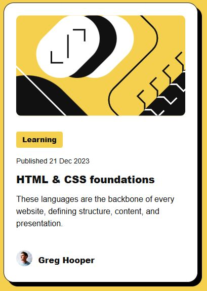

## Table of contents

- [Overview](#overview)
  - [Screenshot](#screenshot)
  - [Links](#links)
- [My process](#my-process)
  - [Built with](#built-with)
  - [Useful resources](#useful-resources)
- [Author](#author)

## Overview
This project is a solution to the blog preview card challenge from Frontend Mentor, aimed at sharpening my front-end development skills. The objective was to build a blog card component using well-structured HTML and styled with CSS. In this README, I outline the process from interpreting the design to implementing a clean, responsive layout. Suggestions and feedback are appreciated!

### Screenshot

### Links

- Solution URL: (https://github.com/BoxyPipesnake/blog-Card)
- Live Site URL: (https://your-live-site-url.com)

## My process

I started by reviewing the Figma design to understand the layout and determine the semantic elements. After defining class names, I set up the HTML and imported fonts, along with normalize.css to standardize styles across browsers and CSS variables for fonts, colors, font sizes, and weights in styles.css.

With the basics in place, I styled the elements to match the design, adding rounded corners to the .content-wrapper, .img-container, and .code-img, and finished by adding a box shadow to .content-wrapper and a hover effect to .course-heading.

### Built with

- Semantic HTML5 markup
- CSS custom properties
- Flexbox

### Useful resources

- [Kevin Powell Video](https://www.youtube.com/watch?v=wARbgs5Fmuw) - This helped me for changing the size of the fonts in a media query. 

## Author

- Frontend Mentor - [@BoxyPipesnake](https://www.frontendmentor.io/profile/BoxyPipesnake)